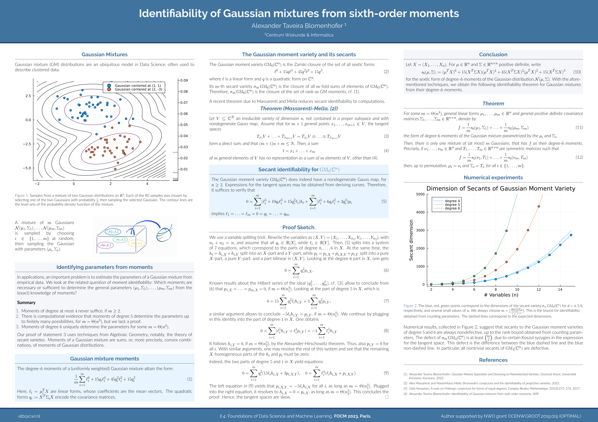

## Talks

This is a recording of a talk on the topic of my recent [preprint on powers of forms decomposition](https://arxiv.org/abs/2305.06860), which I gave at the Oberwolfach workshop [Real Algebraic Geometry with a View toward Koopman Operator Methods](https://www.mfo.de/occasion/2311/www_view).  

 <!-- These are recordings of talks, which I gave at recent conferences.  -->

<figure> 
          

          <video width="100%" height="auto" controls> <source src="/assets/videos/23-03-oberwolfach.mp4" type="video/mp4"> </video>
          <figcaption>
            Powers-of-forms decomposition via Sums of squares.   
            Oberwolfach, March 2023.  
          </figcaption>
          

</figure>

Check out my [CV](/cv/) for my other presentations at conferences. 

## Posters

|  |
|:--:|
| My poster on [the dimension of invariant secant varieties](http://arxiv.org/abs/2312.12335), |
| which I presented at Mega 2024 in Leipzig.  |
| Also available as [**pdf download**](/assets/pdf/mega2024-poster.pdf). |

<!-- |  |
|:--:|
| My new poster on [Gaussian identifiability](https://arxiv.org/abs/2307.03850), |
| which I presented at FOCM 2023, Paris.  |
| Also available as [**pdf download**](/assets/pdf/gaussian-deg6ident-poster.pdf). | -->

<!-- |  | 
|:--:|
| Powers-of-forms decomposition via Sums of squares |
| Oberwolfach, March 2023. |   -->

<!-- | <video width="50%" height="auto" controls> <source src="assets/videos/23-03-oberwolfach.mp4" type="video/mp4"> </video> | <video width="50%" height="auto" controls> <source src="assets/videos/23-03-oberwolfach.mp4" type="video/mp4"> </video>|
|:--:|:--:| 
| Powers-of-forms decomposition via Sums of squares | ... |
| Oberwolfach, March 2023. |  SIAM | -->
