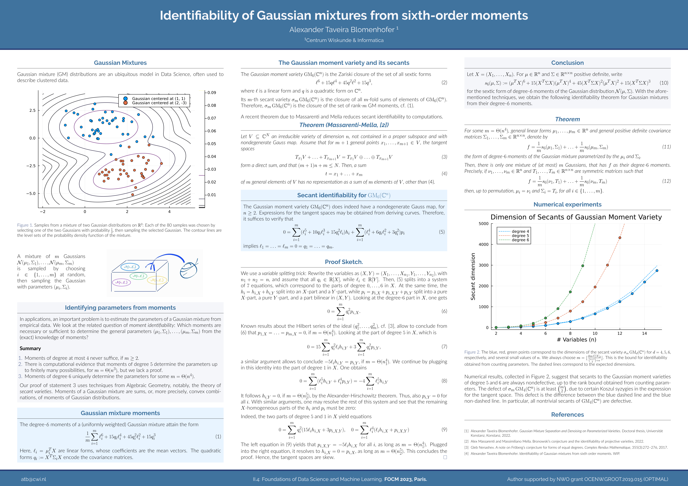

## Recorded talks

Here are recordings of two talks on tensor decomposition and identifiability.

<figure>
  <video width="100%" height="auto" controls preload="metadata" playsinline>
    <source src="/assets/videos/tenors-2025-tensor-decomposition.mp4" type="video/mp4">
    Your browser does not support embedded MP4 video.
  </video>
  <figcaption>
    <strong>Recent advances in tensor decomposition and identifiability.</strong> 
    TENORS Workshop, Universität Konstanz, September 2025.
  </figcaption>
</figure>

<figure> 
  <video width="100%" height="auto" controls preload="metadata" playsinline>
    <source src="/assets/videos/23-03-oberwolfach.mp4" type="video/mp4">
    Your browser does not support embedded MP4 video.
  </video>
  <figcaption>
    <strong>Powers-of-forms decomposition via sums of squares.</strong> 
    <a href="https://www.mfo.de/occasion/2311/www_view">Oberwolfach workshop</a>, March 2023. The associated work is now published as <a href="https://doi.org/10.1137/23M1573355">On Uniqueness of Power Sum Decomposition</a>.
  </figcaption>
</figure>

## Posters

|  |
|:--:|
| In August 2025, I presented “The contraction variety of a tensor” at the Computations in Algebraic Geometry meeting at ETH Zürich. |
| Also available as [**pdf download**](/assets/pdf/the-contraction-variety-of-a-tensor.pdf). |

|  |
|:--:|
| My poster on [nondefectivity of invariant secant varieties](https://arxiv.org/abs/2312.12335), |
| which I presented at Mega 2024 in Leipzig.  |
| Also available as [**pdf download**](/assets/pdf/mega2024-poster.pdf). |

<!-- |  |
|:--:|
| My new poster on [Gaussian identifiability](https://arxiv.org/abs/2307.03850), |
| which I presented at FOCM 2023, Paris.  |
| Also available as [**pdf download**](/assets/pdf/gaussian-deg6ident-poster.pdf). | -->

<!-- |  | 
|:--:|
| Powers-of-forms decomposition via Sums of squares |
| Oberwolfach, March 2023. |   -->

<!-- | <video width="50%" height="auto" controls> <source src="assets/videos/23-03-oberwolfach.mp4" type="video/mp4"> </video> | <video width="50%" height="auto" controls> <source src="assets/videos/23-03-oberwolfach.mp4" type="video/mp4"> </video>|
|:--:|:--:| 
| Powers-of-forms decomposition via Sums of squares | ... |
| Oberwolfach, March 2023. |  SIAM | -->
